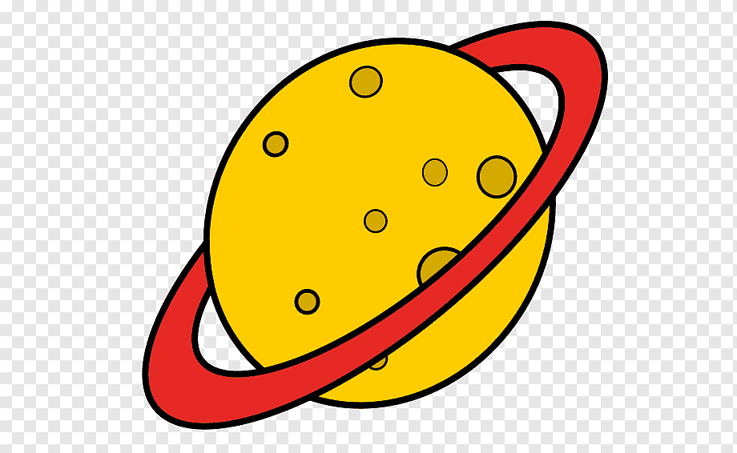

  

<h1 align="center">WebSite Planetario</h1> 

Website com o tema de planetario

Tabela de conteúdos
=================
<!--ts-->
   * [Sobre](#Sobre)
   * [Tabela de Conteudo](#tabela-de-conteudo)
   * [Instalação](#Instalação)
   * [Como usar](#como-usar)
      * [Pre Requisitos](#pre-requisitos)
   * [Tecnologias](#tecnologias)
<!--te-->

<h4 align="center"> 
      	✔️  Pronto  ✔️
</h4>

## Sobre

Projeto feito com o objetivo de treinar o CSS e o HTML.

## Tabela de conteudo

- [x] HTML
- [x] CSS

## Instalação

Falar como instalar o programa na maquina
Falar tambem como deve ser instalado bibliotecas ou arquivos adicionais

## Como usar

Falar como deve ser usado e explicar as funções do arquivo

## Pre Requisitos

Falar sobre o que precisa para rodar o programa e como

## Tecnologias

<table>
    <tr>
    <td>HTML</td>
    <td>CSS</td>
    <td>Javascript</td>
    </tr>
    <tr>
    <td>5.*</td>
    <td>3.*</td>
    <td>-</td>
    </tr>
</table>